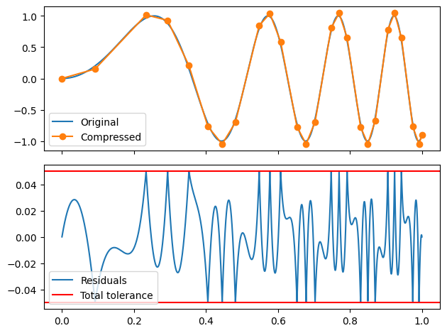
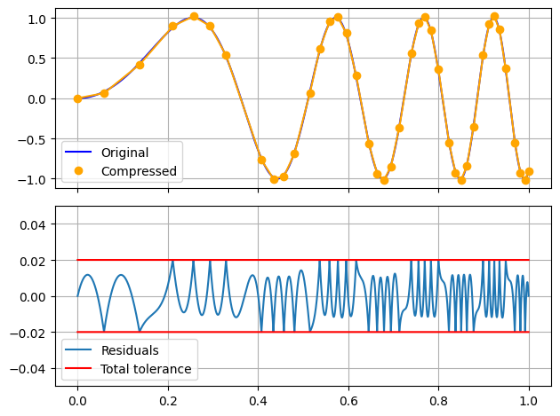
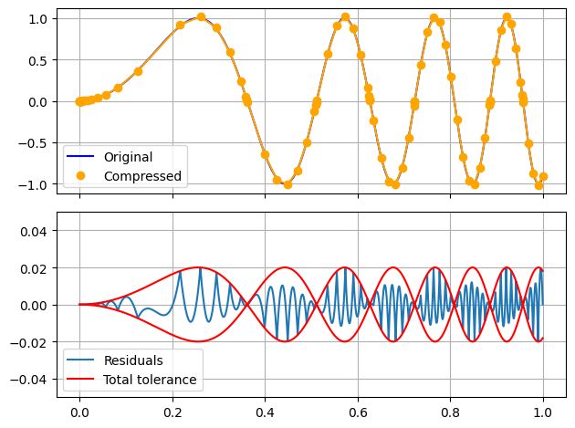
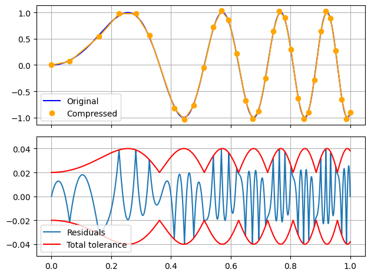
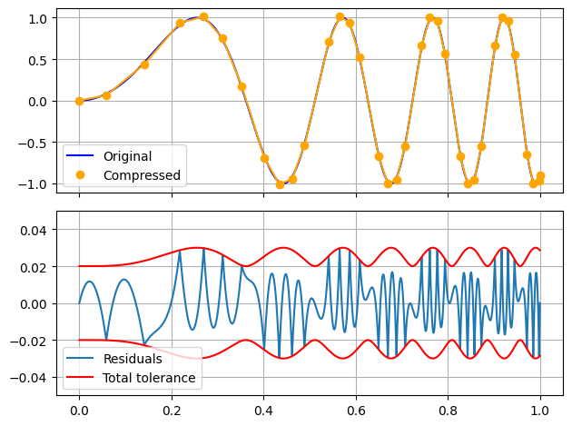
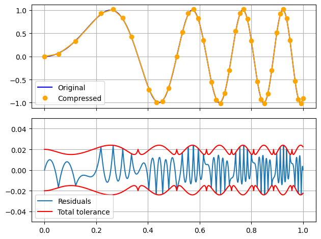
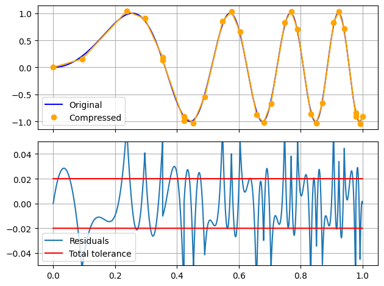
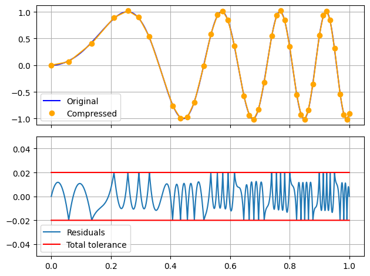
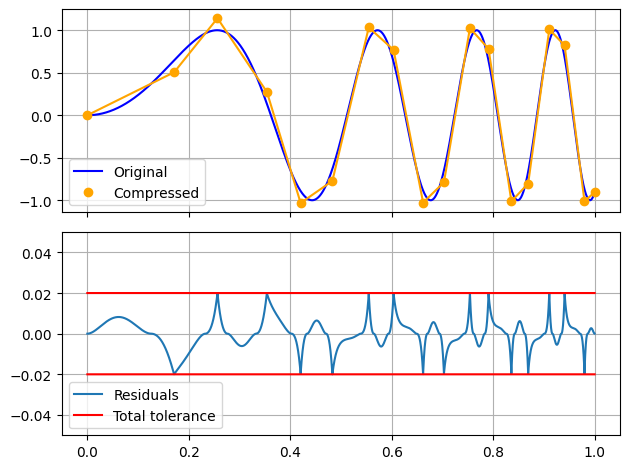

# Overview <!-- omit in toc -->

[](https://pypi.org/project/limesqueezer)
[](https://pypi.org/project/limesqueezer)
[](https://pypi.org/project/limesqueezer)
[](https://pypi.org/project/limesqueezer)
[](https://github.com/limespy/limesqueezer/compare/v1.0.11...master)

Lossy compression with controlled error tolerance for smooth data series

## Table of Contents  <!-- omit in toc -->
- [Quick Start Guide](#quick-start-guide)
  - [Install](#install)
  - [Starting](#starting)
  - [Compressing](#compressing)
  - [Decompressing](#decompressing)
  - [Plotting](#plotting)
- [User Guide](#user-guide)
  - [Compression](#compression)
  - [Parameters](#parameters)
    - [Tolerances](#tolerances)
    - [Errorfunctions](#errorfunctions)
    - [Stream](#stream)
  - [Decompression](#decompression)
  - [Combining compression methods](#combining-compression-methods)
- [Meta](#meta)
  - [Versioning](#versioning)
  - [Changelog](#changelog)

# Quick Start Guide

## Install


Install latest release via `pip`

```
pip install limesqueezer
```

As dependencies you'll get [NumPy](https://numpy.org/) and [Numba](https://numba.pydata.org/)

## Starting

limesqueezer uses numpy ndarrays types for input and output.
Package import name is `limesqueezer`.
Author recommends abbreviation `ls`.
Rest of documentation uses this abbreviation.

``` python
import numpy as np
import limesqueezer as ls
```
For example let's make mock data.
An array of values (`xdata`) and an array of dependent values (`ydata`), i.e. $y_n = f(x_n)$

You can imagine that these have come e.g. from some simulation or measurements.
``` python
x_data = np.linspace(0, 1, 10000)
y_data = np.sin(24 * x_data ** 2)
```

## Compressing

These can be simply compressed with absolute tolerance of e.g. 0.05
``` python
tolerance = 0.05
x_compressed, y_compressed = ls.compress(x_data, y_data, tolerances = tolerance)
```

Or maybe you have some generator-like thing that gives out numbers, e.g. some simulation step.
For sake of example there the mock generator 
``` python
x0, y0 = x_data[0], y_data[0]
generator = zip(x_data[1:], y_data[1:])
```

Here you use the context manager `Stream`.
It needs to be initialise with first values of the series, here I am just going to use the first from the mock x and y data.

Compressed values can then be accessed from the `record`
``` python
with ls.Stream(x0, y0, tolerances = tolerance) as record:
    for x_value, y_value in generator:
        record(x_value, y_value)

x_compressed, y_compressed = record.x, record.y
```

## Decompressing

These can then be decompressed into an spline interpolation function.

``` python
function = ls.decompress(x_compressed, y_compressed)
y_decompressed = function(y_data)
```

## Plotting

With this function e.g. resuduals can be computed and checked against the tolerance

``` python
residuals = y_decompressed - y_data
maximum_error = np.amax(np.abs(residuals))
print(f'Maximum error should be ~= {tolerance}: {maximum_error:.5f}')
```

and when plotting the output with `matplotlib` you should see it

``` python
from matplotlib import pyplot as plt

fig, axs = plt.subplots(2,1, sharex=True)
# Data and compressed
axs[0].plot(x_data, y_data, label='Original')
axs[0].plot(x_compressed, y_compressed, '-o', label ='Compressed')
axs[0].legend()

# Residuals to tolerance
residuals = y_decompressed - y_data
axs[1].plot(x_data, y_decompressed - y_data, label = 'Residuals')
axs[1].axhline(tolerance, label = 'Total tolerance', color = 'red')
axs[1].axhline(-tolerance, color = 'red')
axs[1].legend()

fig.tight_layout()
plt.show()
```


# User Guide

VERY MUCH WORK IN PROGRESS

## Compression

## Parameters

### Tolerances

Keyword `tolerances`

Tolerances
Absolute Tolerance, Relative Tolerance and Falloff to smooth between them.

Absolute tolerance -only is the default



tolerances, Falloff determines how much the absolute error is reduced as y value grows.
- If 3 values: (relative, absolute, falloff)
- If 2 values: (relative, absolute, 0)
- If 1 value:  (0, absolute, 0)

Allowed deviation is calculated with following function

$$
deviation = Relative \cdot |Y_{DATA}| + \frac{Absolute}{Falloff \cdot |Y_{DATA}| + 1}
$$

$$
D_{|Y|}^1 deviation = Relative - \frac{Absolute \cdot Falloff}{(Falloff \cdot |Y_{DATA}| + 1)^2}
$$

To have constrain that

$$
D_{|Y_{DATA}|}^1 deviation(Y_{DATA} = 0) \geq 0 
$$

Means

$$
Relative \geq Absolute \cdot Falloff 
$$




Relative + absolute tolerance without falloff



Smooth falloff is at

$$
Falloff = \frac{Relative}{Absolute}
$$



If you go over the smooth falloff limit, you make tolerance function non-monotonic, so it first _decreases_ as the absolute y value increases and then starts to increase.



Recommended

`errorfunction`


You have some data from system of equations
For this example, let's make 100 000 datapoints along some function
``` python
input_x = np.linspace(0, 1, int(1e4))
input_y = np.sin(24 * input_x ** 2)
```

Or maybe you have some generator-like thing that gives out numbers.
E.g. some simulation step
Here you use the context manager "Stream"
Initialise with first values, here I am just going to use the first

### Errorfunctions

The default, `MaxAbs`.
Maximum of the absolute residual 

$$
\max(|residual| - tolerance)
$$


$$
\max(mean(|residuals|))
$$



$$
\max(\max(mean(|residuals| - tolerance)), (|residuals| - tolerance)[-1])
$$



Here the Residuals is actually $residuals^2$

$$
\max(mean(residuals^2 - tolerance))
$$


$$
\max(max(mean(residuals^2 - tolerance)), (residuals^2 - tolerance)[-1])
$$


### Stream

Context manager and a class.

- Data is fed one point at the time.
- Context manager is used to ensure proper finishing of the compression process.

``` python
with ls.Stream(example_x0, example_y0, tol = 1e-3) as record:
    for example_x_value, example_y_value in generator:
        record(example_x_value, example_y_value)
```
Using record.x or record.y in the with statement block results in
attribute error, as those attributes are generated only when 
the record is closed.

If you want to access the data fed to the record, you can use
``` python
x_compressed, y_compressed = record.xc, record.yc
```
to access the already compressed data and

``` python
x_buffered, y_buffered = record.xb, record.yb
```
to access the buffered data waiting more values or closing of
the record to be compressed.


``` python
output_x, output_y = record.x, record.y
print(record.state)
print(record)
```

A side mote: In English language the word 'record' can be either
verb or noun and since it performs this double role of both taking
in data and being storage of the data, it is a fitting name for the object

## Decompression

Decompression is done in two main steps with spline interpolation.
First an spline function is created.
Then that can be called with x values to get corresponding y values.

This two-step approach allows more flexible use of the data.

## Combining compression methods

This compression method can be combined with lossless compressiom to achieve even higher compression ratios.
The lossless compression should be done only after the lossy compression this package provides.


# Meta

## Versioning

This package follows sematic versioning's (<https://semver.org/>) three summary tenets, but full specification only partially

Version code is composed of three numbers:
**Major**, **Minor**, **Patch**

Experimental, alpha or beta versions are indicated by a 0 as one of those three.

First public release starts with Major version 1.
Incrementation of Major Version indicates backwards compatibility breaking change in API or fuctionality.

Minor Version indicates design or specification

While the Minor Version is 0, the package is in public alpha stage.
That means features and API may change erraticly and without warning with increment in Patch Version.

Later incrementation of the Minor Version signifies upgrades to the features and interfaces.
In general changes here mean changes in the design and specification, but not such that it breaks backwards compatibility
I.e. code that works with _documented_ features of X.n.x will work with X.n+1.y

Patch Version indicate implementation.
These are bugfixes, typo corrections, documentation clarifications.
In Patch Version incementation the only the implementation is changed and **not**  _intention_, i.e. intended documented behaviour of the Minor Version is **not** changed
So undocumented behaviour may change but documented behaviour stays same.

Releases on PyPI after version 1.1.1 will all have nonzero versions.
Versions such as 1.2.0 or 2.0.3 are reserved for development and would be available on from the source reposotory.

TL;DR
- Undocumented behaviour can change erraticly, without warning, and without 

## Changelog

### 1.0.13 2022-XX-XX <!-- omit in toc -->

- README image links fixed

### 1.0.12 2022-07-28 <!-- omit in toc -->

- Changed README to Markdown-only
- Updated documentation
- Some refactoring
- Fixed type hints to pass MyPy type checking

### 1.0.11 2022-07-16 <!-- omit in toc -->

- Debug plotting improvements
- Added undocumented API for other fitting functions
- More tests
- Profiling and benchmarking from tests

### 1.0.10 2022-05-08 <!-- omit in toc -->


- Cleaned documentation

### 1.0.9 2022-04-03 <!-- omit in toc -->


- Block and stream compression are much more uniform
- Restructuring
- Tests
- Profiling

### 1.0.8 2022-03-20 <!-- omit in toc -->

- Step-by-step style ploting of the compression.

### 1.0.7 2021-12-07 <!-- omit in toc -->

### 1.0.6 2021-12-02 <!-- omit in toc -->

### 1.0.5 2021-12-02 <!-- omit in toc -->

### 1.0.4 2021-12-01 <!-- omit in toc -->

### 1.0.3 2021-11-30 <!-- omit in toc -->

- First release on PyPI.
