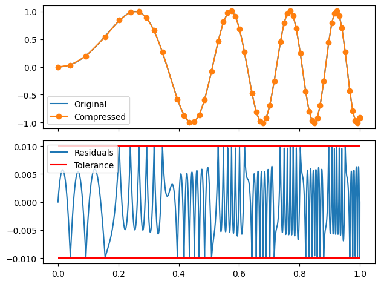

# interp-compression

Lossy compression tools for smooth data series.
WIP

- [interp-compression](#interp-compression)
  - [Use](#use)
    - [Examples](#examples)
      - [Block](#block)
      - [Stream](#stream)
    - [Combining comression methods](#combining-comression-methods)

## Use
### Examples

limesqueezer uses numpy ndarrays types for input and output.
The package itself with author-recommended abbreviation.
Rest of documentation uses this abbreviation.
``` python
    import numpy as np 
    import limesqueezer as  ls 
```

You have some data from system of equations
For example, let's take 100 000 datapoints along some function
``` python
    input_x = np.linspace(0,1,int(1e4))
    input_y = np.sin(24 * input_x ** 2)
```


Or maybe you have some generator-like thing that gives out numbers.
E.g. some simulation step
Here you use the context manager "Stream"
Initialise with first values, here I am just going to use the first

#### Block

A function.

The whole of data is given as input.

To simplify the interface, the package has beem made callable.
Now you want to compress it with maximum absolute error being 1e-3.

``` python
    output_x, output_y = ls(input_x, input_y, tol = 1e-3)
```

You can also use

``` python
    output_x, output_y = ls.compress(input_x, input_y, tol = 1e-3)
```
if that is more comfortable for you.

#### Stream

Context manager and a class.

- Data is fed one point at the time.
- Context manager is used to ensure proper finishing of the compression process.

``` python
    example_x0, example_y0 = input_x[0], input_y[0]
    generator = zip(input_x[1:], input_y[1:])
```
The context manager for Stream data is 'Stream'.

``` python
    with ls.Stream(example_x0, example_y0, tol = 1e-3) as record:
        for example_x_value, example_y_value in generator:
            record(example_x_value, example_y_value)
```
Using record.x or record.y in the with statement block results in
attribute error, as those attributes are generated only when 
the record is closed.

If you want to access the data fed to the record, you can use
``` python
    x_compressed, y_compressed = record.xc, record.yc
```
to access the already compressed data and

``` python
    x_buffered, y_buffered = record.xb, record.yb
```
to access the buffered data waiting more values or closing of
the record to be compressed.

A side mote: In English language the word 'record' can be either
verb or noun and since it performs this double role of both taking
in data and being storage of the data, it is a fitting name for the object

``` python
    output_x, output_y = record.x, record.y
    print(record.state)
    print(record.__str__)
```



### Combining comression methods

This compression method can be combined with lossless compressiom to achieve even higher compression ratios.
The lossless compression should come after doing the compression this package provides.