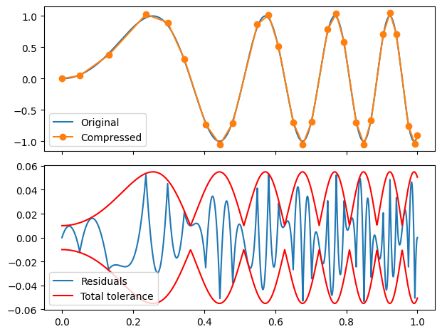

========
Overview
========

.. start-badges

.. list-table::
    :stub-columns: 1

    * - package
      - | |version| |wheel| |supported-versions| |supported-implementations|
        | |commits-since|

.. |version| image:: https://img.shields.io/pypi/v/limesqueezer.svg
    :alt: PyPI Package latest release
    :target: https://pypi.org/project/limesqueezer

.. |wheel| image:: https://img.shields.io/pypi/wheel/limesqueezer.svg
    :alt: PyPI Wheel
    :target: https://pypi.org/project/limesqueezer

.. |supported-versions| image:: https://img.shields.io/pypi/pyversions/limesqueezer.svg
    :alt: Supported versions
    :target: https://pypi.org/project/limesqueezer

.. |supported-implementations| image:: https://img.shields.io/pypi/implementation/limesqueezer.svg
    :alt: Supported implementations
    :target: https://pypi.org/project/limesqueezer

.. |commits-since| image:: https://img.shields.io/github/commits-since/limespy/limesqueezer/v1.0.10.svg
    :alt: Commits since latest release
    :target: https://github.com/limespy/limesqueezer/compare/v1.0.10...master

.. end-badges

Lossy compression tools for smooth data series. WIP

* Free software: MIT license

Installation
============

::

    pip install limesqueezer

You can also install the in-development version with::

    pip install https://github.com/limespy/limesqueezer/archive/master.zip

Documentation
=============

Examples
========

    
    Example with error function being maximum of maximum absolute error

limesqueezer uses numpy ndarrays types for input and output.
The package itself with author-recommended abbreviation.
Rest of documentation uses this abbreviation.

.. code-block:: python

    import numpy as np 
    import limesqueezer as  ls 

You have some data from system of equations
For example, let's take 100 000 datapoints along some function

.. code-block:: python

    input_x = np.linspace(0, 1, int(1e5))
    input_y = np.sin(6 * input_x * input_x)

Now you want to compress it with maximum absolute error being 1e-3.

Or maybe you have some generator-like thing that gives out numbers.
E.g. some simulation step
Here you use the context manager "Stream"
Initialise with first values, here I am just going to use the first

Block
-----

To simplify the interface, the package has beem made callable.

.. code-block:: python

    output_x, output_y = ls(input_x, input_y, tol = 1e-3)

You can also use

.. code-block:: python

    output_x, output_y = ls.compress(input_x, input_y, tol = 1e-3)

if that is more comfortable for you.

Stream
------

.. code-block:: python

    example_x0, example_y0 = input_x[0], input_y[0]
    generator = zip(input_x[1:], input_y[1:])

The context manager for stream data is called 'Stream'.

.. code-block:: python

    with ls.Stream(example_x0, example_y0, tol = 1e-3) as record:
        for example_x_value, example_y_value in generator:
            record(example_x_value, example_y_value)

Using record.x or record.y in the with statement block results in
attribute error, as those attributes are generated only when 
the record is closed.

If you want to access the data fed to the record, you can use

.. code-block:: python

    x_compressed, y_compressed = record.xc, record.yc

to access the already compressed data and

.. code-block:: python

    x_buffered, y_buffered = record.xb, record.yb

to access the buffered data that is waiting more values or closing of
the record to be compressed.

A side mote: In English language the word 'record' can be either
verb or noun and since it performs this double role of both taking
in data and being storage of the data, it is a fitting name for the object

.. code-block:: python

    output_x, output_y = record.x, record.y
    print(record.state)
    print(record.__str__)